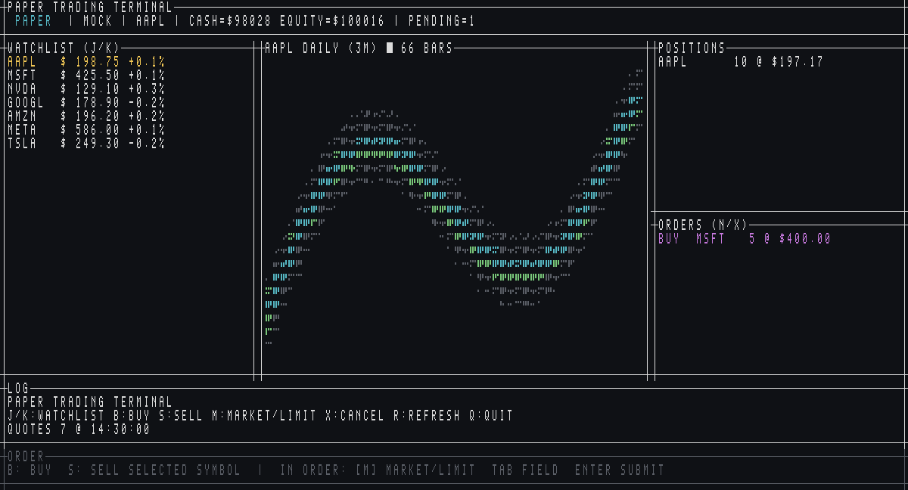

<h1 align="center">paper-trading-terminal</h1>

<p align="center"><strong>AI ネイティブの米国株ペーパートレード CLI</strong> — リアルタイム相場、ポートフォリオ、取引。</p>

<p align="center"> <a href="README.md">English</a> · <a href="README.zh-CN.md">简体中文</a> · <a href="README.zh-TW.md">繁體中文</a> · 日本語 · <a href="README.ko.md">한국어</a></p>

## 機能

- **ペーパー口座** — 現金・ポジション・時価評価損益を SQLite に永続化；TUI の `z` で `initial_cash` にリセットしポジション・注文をクリア
- **注文** — 成行/指値の売買、キャンセル、指値到達で自動約定；TUI で約定価格と手数料を表示
- **リアルに近いシミュレーション** — セッション対応（通常/プレ/アフター/休場）、ロットサイズ、A 株の値幅制限と T+1 売却ロック、市場別規制料金 + 設定可能なブローカー手数料
- **マーケットデータ** — Yahoo 優先、Financial Context CLI フォールバック；両方ダウン時は明確にエラー
- **TUI** — 端末サイズに応じたレイアウト、ウォッチリスト、Braille ローソク足のページ送り、アプリ内発注、約定通知
- **AI ネイティブ** — 構造化 JSON I/O、`paper schema` によるツール発見、Rust 埋め込み用 `AgentSkill`
- **Rust ライブラリ** — `AgentSkill` と `TradingEngine` で埋め込み可能

## 要件

- **paper** バイナリが `PATH` にあること（下記 [インストールと実行](#インストールと実行)）
- **Financial Context** CLI — *任意*；Yahoo 不可時のフォールバック

ソースからビルドする場合は Rust stable ≥ 1.91（Yahoo はデフォルト有効）。

### AI エージェントによるインストール（Claude / Codex / OpenClaw）

コーディングエージェントにインストールと検証を任せられます。**[docs/agent-install.md](docs/agent-install.md)** のプロンプトを Claude Code、Codex、OpenClaw に貼り付け、`paper quote AAPL` が動くまで実行させてください。

<details>
<summary>クイックコピー — 汎用インストールプロンプト</summary>

```text
このマシンに paper-trading-terminal CLI（`paper`）をインストールしてください。

プロジェクト：https://github.com/tsui66/paper-trading-terminal

ルール：
- OS を自分で判別し、公式インストーラを実行すること（コマンドを表示するだけは不可）。
- macOS/Linux：curl -sSL https://github.com/tsui66/paper-trading-terminal/raw/main/install | sh
- Windows PowerShell：iwr https://github.com/tsui66/paper-trading-terminal/raw/main/install.ps1 | iex

検証：paper -h → paper config provider-status → paper quote AAPL → paper account。
スクリプト失敗時は Homebrew / Scoop / cargo build --release を試す。
インストールパスと検証結果を報告。Yahoo が失敗しない限り fcontext は任意。
```

エージェント別・fcontext・JSON 連携：[docs/agent-install.md](docs/agent-install.md)。

</details>

## インストールと実行

順番に実行してください。各ステップの出力で成功を確認します。

### ステップ 1 — `paper` のインストール

プラットフォームに応じて **1 つ** のコマンドを実行。

**macOS / Linux（推奨）**

```bash
curl -sSL https://github.com/tsui66/paper-trading-terminal/raw/main/install | sh
```

想定出力：

```text
Installing paper-trading-terminal@v…
Downloading https://github.com/tsui66/paper-trading-terminal/releases/download/…
paper CLI v… installed to /usr/local/bin/paper

Next steps:
  paper -h                      # verify install
  paper config provider-status  # check yahoo + fcontext (optional)
  paper quote AAPL              # test live quote
  paper tui                     # launch dashboard
```

**Windows（PowerShell）**

```powershell
iwr https://github.com/tsui66/paper-trading-terminal/raw/main/install.ps1 | iex
```

`paper CLI v… installed` が表示されます。初回は PATH 追加のメッセージあり。**`paper` が見つからない場合はターミナルを再起動。**

<details>
<summary>その他のインストール方法</summary>

**Homebrew（macOS / Linux）**

```bash
brew install --cask tsui66/tap/paper-trading-terminal
```

**Windows（[Scoop](https://scoop.sh)）**

```powershell
scoop install https://github.com/tsui66/paper-trading-terminal/raw/refs/heads/main/.scoop/paper.json
```

**ソースからビルド**（Rust ≥ 1.91）

```bash
git clone https://github.com/tsui66/paper-trading-terminal
cd paper-trading-terminal
cargo build --release
# バイナリ：./target/release/paper
make install-local   # 任意：/usr/local/bin へコピー
```

Fork / 自前ホスト：

```bash
PAPER_INSTALL_REPO=your-org/paper-trading-terminal curl -sSL https://github.com/tsui66/paper-trading-terminal/raw/main/install | sh
```

</details>

### アップグレード

```bash
paper upgrade --check          # GitHub 最新リリースと比較
paper upgrade                  # 現在のバイナリをダウンロードして置換
paper upgrade --version v0.0.2 # 指定バージョンをインストール
```

[GitHub Releases](https://github.com/tsui66/paper-trading-terminal/releases) を使用。`PAPER_INSTALL_REPO=owner/name` または `--repo` でリポジトリを上書き可能。

### ステップ 2 — `paper` の検証

```bash
paper -h
paper config provider-status
```

想定：ヘルプ表示；`yahoo` が **ok**（プライマリ）。初回は `fcontext` が **missing** でも可（ステップ 4 は任意）。

```bash
paper quote AAPL
```

想定：`AAPL  $…  +….%  [yahoo]` のような 1 行。

### ステップ 3 — 実行

```bash
paper account          # 現金とエクイティ
paper tui              # 対話型ダッシュボード
```

TUI：`j`/`k` でウォッチリスト、`b`/`s` で売買、`Tab` で足種、`←`/`→` でチャートページ（古い/新しい）、`z` で口座リセット（二重確認）、`q` で終了。

**CLI ペーパートレード**

```bash
paper buy AAPL --qty 10
paper buy MSFT --qty 5 --limit 500   # 指値 — 価格到達まで待機
paper orders
paper cancel <order-id-prefix>
paper portfolio --json
```

### ステップ 4 —（任意）Financial Context CLI フォールバック

Yahoo が問題なければスキップ可。以下の場合にインストール：

- バックアップが欲しい（`fcontext: missing`）
- Yahoo が不安定で失敗する
- Yahoo にない銘柄・データが必要

`paper` は `fcontext`（または `fctx`）を自動呼び出し。デフォルト `config.toml` で足ります。

**4a. CLI のインストール**

macOS（Homebrew）：

```bash
brew install --cask aitaport/tap/fcontext-cli
```

Linux / macOS（スクリプト）：

```bash
curl -sSL https://github.com/aitaport/fcontext-cli/releases/latest/download/install.sh | sh
```

Windows（PowerShell）：

```powershell
iwr https://github.com/aitaport/fcontext-cli/releases/latest/download/install.ps1 | iex
```

Windows（Scoop）：

```powershell
scoop install https://github.com/aitaport/fcontext-cli/releases/latest/download/fcontext.json
```

`fcontext`（と `fctx`）が `PATH` にあること：

```bash
fcontext -h
```

**4b. サインイン（初回のみ）**

```bash
fcontext auth login
```

ブラウザで URL を開き認可後：

```bash
fcontext auth login --auth-code YOUR_CODE
```

確認：

```bash
fcontext auth status
fcontext check
```

**4c. `paper` で検証**

```bash
fcontext quote AAPL.US --format json
paper config provider-status
paper quote AAPL
```

想定：provider-status で `fcontext` が **ok**；引用は `[yahoo]` または `[fcontext]`。

`paper` は `AAPL` を受け付け；fcontext 内部は `AAPL.US`。

詳細：[Financial Context CLI ドキュメント](https://docs.fcontext.com)。

## クイックリファレンス

グローバルフラグ（全コマンド）：

| フラグ | 説明 |
|--------|------|
| `--json` | 機械可読 JSON 出力 |
| `--config PATH` | 設定ファイル（デフォルト `./config.toml`） |
| `--db PATH` | SQLite パス（デフォルト `data/paper.db`） |

環境変数：`PAPER_CONFIG` で設定パスを上書き（旧名：`PPT_CONFIG`）。

## マーケットデータプロバイダ

`config.toml` のデフォルトチェーン：

```toml
[provider]
default = "yahoo"
fallback = ["fcontext"]

[provider.fcontext]
cli = "fcontext"
timeout_secs = 30
```

| 優先 | プロバイダ | 備考 |
|------|------------|------|
| 1 | **yahoo** | デフォルト；無料 Yahoo Finance（不安定な場合あり） |
| 2 | **fcontext** | Financial Context CLI フォールバック；インストール + `fcontext auth login` |

```
yahoo ──失敗──► fcontext ──失敗──► エラー（操作中止）
```

診断：

```bash
paper config provider-status
```

## TUI

```bash
paper tui
```



端末サイズに応じてパネル幅・行高・表の文字サイズが自動調整（推奨最小約 80×24）。コンパクトモードではフッターのショートカット表示が短くなります。

| キー | 操作 |
|------|------|
| `j` / `k` または `↓` / `↑` | ウォッチリスト選択移動 |
| `Enter` | ハイライト銘柄を選択（チャート読込） |
| `Tab` / `Shift-Tab` | 足種（1m … Year）；最新ページにリセット |
| `←` / `→` | チャートページ — **1 キー = 画面一杯の足**（← 過去、→ 新しい） |
| `b` / `s` | 選択銘柄の買い / 売り |
| `m` | 注文バーで成行 / 指値切替 |
| `Enter` | 注文送信（注文バー有効時） |
| `Esc` | 注文キャンセル、または口座リセット確認のキャンセル |
| `n` | 保留注文の選択切替 |
| `x` | 選択中の保留注文をキャンセル |
| `z` | 口座リセット — 2 回押して確認；`initial_cash` 復元、ポジション・注文クリア |
| `r` | 相場・チャート更新 |
| `q` | 終了 |

**パネル：** ウォッチリスト（左）、ローソク足（中央）、保有 + 保留注文（右）、ログ、注文/ショートカットバー（下）。注文表は銘柄・売買・種別・数量・約定価格・手数料・状態。

**チャート操作：** ページ 0 が最新。`←` で過去ページを読み込み（オンデマンド取得）。`→` で新しい方へ。注文バー表示中は矢印キー無効（`Esc` で終了）。

指値約定時はベル音と `*** FILLED ***` ログ（手数料内訳付き）。

## CLI リファレンス

| コマンド | 説明 |
|----------|------|
| `account` | 現金、エクイティ、ポジション数 |
| `portfolio` | 時価評価の内訳 |
| `positions` | 保有ポジション |
| `quote SYM [SYM…]` | リアルタイム相場 |
| `historical SYM --range m6 --interval d1` | OHLCV ローソク足 |
| `buy SYM --qty N [--limit P]` | 成行または指値買い |
| `sell SYM --qty N [--limit P]` | 成行または指値売り |
| `orders` | 保留中の指値注文 |
| `cancel ID` | UUID またはプレフィックスでキャンセル |
| `history` | 約定 / キャンセル履歴 |
| `pnl` | 実現 + 未実現損益 |
| `config show` | 現在の設定 |
| `config set-provider NAME` | `yahoo` \| `fcontext` |
| `config set-fallback a,b` | カンマ区切りフォールバック |
| `config provider-status` | 各プロバイダとチェーンをプローブ |
| `schema` | エージェント統合 schema（JSON） |
| `upgrade` | 最新リリースをダウンロードして `paper` バイナリを置換 |
| `upgrade --check` | 新しいリリースがあるか確認 |
| `upgrade --version v0.0.2` | 指定タグのリリースをインストール |
| `tui` | ダッシュボード起動 |

**レンジ：** `d1` `d5` `m1` `m3` `m6` `y1` `y5`  
**インターバル：** `m1` `m5` `m15` `m30` `h1` `d1` `w1` `mo1`

## 取引シミュレーション

約定は銘柄サフィックスとライブ相場のセッション状態に従います：

| ルール | 米国 | 香港 | A 株（`.SH` / `.SZ`） |
|--------|------|------|------------------------|
| ロット | 1 株 | 100 株（デフォルト） | 100 株 |
| T+1 売却ロック | なし | なし | あり — 翌セッションまで売却不可 |
| 延長取引 | プレ/アフター成行可 | 休場時は指値キュー | 中国セッションに準拠 |
| 値幅制限 | — | — | 指値 ±10%（ST は ±5%） |
| 規制料金 | 売り SEC / FINRA | 印紙税、徴収金 | 印紙税、過戸料 |

プラットフォーム手数料は設定可能；規制料金は常に計上：

```toml
[trading]
commission_per_trade = 0.0   # 注文ごと定額
commission_bps = 0.0         # 名目 bps（1 bps = 0.01%）
min_commission = 0.0
slippage_bps = 5.0
```

**休場** 時は成行拒否；指値はキュー可能。**売買停止**・**上場廃止リスク**銘柄は全注文拒否。

## 設定

プロジェクトルートの `config.toml`（または `--config` / `PAPER_CONFIG`）：

```toml
[account]
initial_cash = 100_000.0
currency = "USD"

[trading]
commission_per_trade = 0.0
commission_bps = 0.0
min_commission = 0.0
slippage_bps = 5.0

[cache]
enabled = true
ttl_secs = 60

[watchlist]
symbols = ["AAPL", "MSFT", "NVDA", "GOOGL", "AMZN", "META", "TSLA"]
```

`.env.example` で環境変数と `RUST_LOG`。Financial Context 認証は Financial Context CLI が管理（`paper` ではない）。

口座リセットは TUI のみ（`z` 二重確認）— CLI `reset` コマンドは未実装。

## エージェントとライブラリ

**エージェント経由インストール：** [docs/agent-install.md](docs/agent-install.md) — Claude Code、Codex、OpenClaw 用プロンプト。

CLI 契約の取得：

```bash
paper schema --json
```

サブプロセス連携例：

```bash
paper portfolio --json
paper buy AAPL --qty 10 --json
```

Rust 埋め込み：

```rust
use paper_trading_terminal::cli::AppState;
use paper_trading_terminal::skill::{agent_schema, AgentSkill};
use paper_trading_terminal::{create_provider_stack, AppConfig, QuoteCache};

let config = AppConfig::load(None)?;
let provider = create_provider_stack(&config, Some(QuoteCache::new(true, 60)));
let skill = AgentSkill::new(AppState::new(config, provider));
let _schema = agent_schema();
```

## 開発

```bash
make test          # cargo test + CLI 統合
make lint          # fmt + clippy
./scripts/test/test_fcontext.sh   # fcontext なし時はスキップ
```

ローカルリリースパッケージ：

```bash
./scripts/package_release.sh                    # ホスト tarball → dist/
./scripts/package_release.sh 0.1.0 darwin-arm64 linux-amd64 windows-amd64
cargo build --no-default-features   # Yahoo なしスリム版
```

`v*` タグで [`.github/workflows/release.yml`](.github/workflows/release.yml) をトリガー（マルチプラットフォーム Release）。

### プロジェクト構成

```
src/
  cli/          # Clap コマンド
  engine/       # TradingEngine、注文、約定、market_rules、tradability
  provider/     # yahoo、fcontext、フォールバックチェーン
  tui/          # Ratatui ダッシュボード（適応レイアウト、K 線ページング）
  skill.rs      # AgentSkill + schema
data/           # SQLite（gitignore）、テスト設定
scripts/
  build_release.sh
  test/         # Shell 統合テスト
```

### アーキテクチャ

```
┌─────────┐   ┌─────────┐
│   CLI   │   │   TUI   │
└────┬────┘   └────┬────┘
     │             │
     └──────┬──────┘
            ▼
     TradingEngine ──► SQLite（口座、注文、ポジション）
            │
            ▼
   FallbackProvider（yahoo → fcontext）
```

## 免責事項

**研究・学習目的のみ。** 本プロジェクトは **ペーパートレード** シミュレーターです。証券会社に接続せず、実注文は行いません。投資助言ではありません。相場は遅延・不正確の可能性があります。利用は自己責任でお願いします。

## ライセンス

MIT — [LICENSE](LICENSE) を参照。